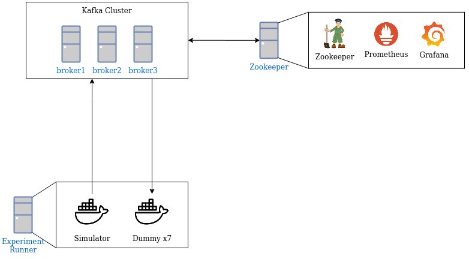

# kafka-experiments

This repository contains code for creating and running all the infrastructure necessary to run the kafka experiments, as well as running all software needed for consuming, producing, getting metrics, simulating pipeline steps, etc.

The idea of the experiment is to:

1. Produce messages using the LSST Schema
2. Consume these messages as a "dummy" step
3. Produce again
4. Repeat 2 and 3 with as many dummy steps as the real pipeline
5. Meassure rate of messages produced to each "dummy" step topic

The first (minimal) attempt will contain the following infrastructure:

Depending on the results of the experiments the infrastructure configuration may vary to have more and bigger instances for each step, more containers for each step and or isolating other components to increase performance.
